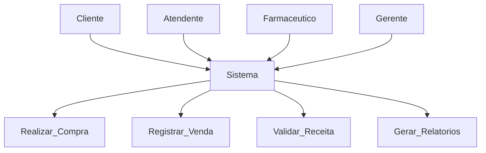

# Avaliação — Engenharia de Software
**Sistema Integrado de Gestão de Farmácia — MVP Definido pelo Estudante**

Aluno: Paulo Bastos Nicioli de Albuquerque
RA: 25000780
Data: 25/03/2026

---

# 1. Definição do MVP
Descreva aqui **qual parte do sistema** foi incluída no seu MVP.  
Explique claramente:

- O que está **dentro** do MVP  
- O que está **fora** do MVP  
- Por que você fez essas escolhas  

Exemplo de início:  
> “Meu MVP cobre o processo de venda desde a identificação/cadastro do cliente até a emissão do comprovante, incluindo tratamento de estoque insuficiente.”

---

# 2. Regras de Negócio (mínimo: 5)
Liste e descreva **cada RN** de forma clara.

**RN01 —**  Produtos só podem ser vendidos se houver estoque disponível.
**RN02 —**  O sistema deve impedir venda sem cadastro do cliente.
**RN03 —**  Produtos com estoque baixo devem gerar alerta.
**RN04 —**   Apenas farmacêuticos podem validar receitas.
**RN05 —**  Toda venda deve gerar comprovante.

(Adicione mais se quiser.)

---

# 3. Requisitos Funcionais (mínimo: 8)
Liste os requisitos funcionais do seu MVP.

**RF01 —**  Consultar produtos
**RF02 —**  Registrar venda
**RF03 —**  Validar receita médica
**RF04 —**  Gerar relatórios
**RF05 —**  Controlar estoque
**RF06 —**  Cadastrar clientes
**RF07 —**  Emitir comprovante
**RF08 —**  Atualizar estoque automaticamente

(Adicione mais se quiser.)

---

# 🛡 4. Requisitos Não Funcionais (mínimo: 4)
Liste os RNFs do sistema conforme seu MVP.

**RNF01 —**  O sistema deve responder em até 2 segundos.
**RNF02 —**  O sistema deve garantir segurança dos dados.
**RNF03 —**  Interface deve ser simples e intuitiva.
**RNF04 —**  Disponibilidade de 99% do tempo.

(Adicione mais se quiser.)

---

# 5. Casos de Uso (mínimo: 10)
### Inserir **diagrama de casos de uso geral**, demonstrando claramente:
O MVP contempla o processo de venda, incluindo consulta de produtos, verificação de estoque, registro da venda e emissão de comprovante. Funcionalidades como relatórios avançados e gestão financeira ficam fora do MVP inicial.

---

# 6. Documentação dos Casos de Uso
Para **cada caso de uso**, utilize o template abaixo:
---

## **UUC01 — Realizar Compra
**Ator(es):**   Cliente, Sistema  
**Descrição:**   Permite ao cliente realizar a compra de produtos.  
**Pré-condições:**  Produto cadastrado e disponível em estoque  
**Pós-condições:**  Venda registrada e comprovante emitido  

## **UC02 — Consultar Produto
Atores: Cliente
Descrição: Permite consultar produtos disponíveis.
Pré-condições: Sistema ativo
Pós-condições: Produto exibido

## **UC03 — Registrar Venda
Atores: Atendente
Descrição: Registra a venda no sistema.
Pré-condições: Produto disponível
Pós-condições: Venda registrada

## **UC04 — Validar Receita
Atores: Farmacêutico
Descrição: Valida receitas médicas.
Pré-condições: Receita apresentada
Pós-condições: Receita validada

## **UC05 — Gerar Relatórios
Atores: Gerente
Descrição: Gera relatórios do sistema.
Pré-condições: Dados disponíveis
Pós-condições: Relatório exibido

## **UC06 — Controlar Estoque
Atores: Sistema
Descrição: Atualiza estoque automaticamente.
Pré-condições: Venda realizada
Pós-condições: Estoque atualizado

## **UC07 — Cadastrar Cliente
Atores: Atendente
Descrição: Cadastra novos clientes.
Pré-condições: Dados informados
Pós-condições: Cliente cadastrado

## **UC08 — Emitir Comprovante
Atores: Sistema
Descrição: Emite comprovante da venda.
Pré-condições: Venda concluída
Pós-condições: Comprovante gerado

## **UC09 — Atualizar Estoque
Atores: Sistema
Descrição: Atualiza estoque após venda.
Pré-condições: Venda realizada
Pós-condições: Estoque atualizado

## **UC10 — Gerenciar Produtos
Atores: Gerente
Descrição: Gerencia cadastro de produtos.
Pré-condições: Acesso autorizado
Pós-condições: Produto atualizado

### Relacionamentos
- **Include:** (listar quando aplicável)  
- **Extend:** (listar quando aplicável)  

### Inserir o diagrama de atividades do Caso de Uso, demonstrando tudo o fluxo princial e alternativos/exceções.

---

> Repita essa estrutura para **todos os seus casos de uso** (mínimo 10).


---

## 7. Diagrama de Caso de Uso


    
---

## 8. Diagrama de Atividade (Venda)

```mermaid
flowchart TD
    A[Início] --> B[Consultar produto]
    B --> C{Produto encontrado?}
    C -->|Não| D[Exibir erro]
    D --> F[Fim]
    C -->|Sim| E[Verificar estoque]
    E --> G{Tem estoque?}
    G -->|Não| D
    G -->|Sim| H[Informar quantidade]
    H --> I[Registrar venda]
    I --> J[Emitir comprovante]
    J --> F[Fim]
